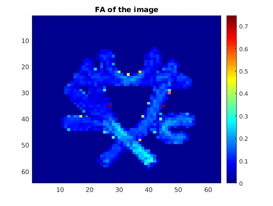
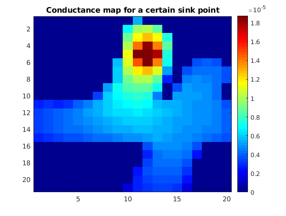

## Example 2: Compute conductance of Fibercup data, and plot it interactively

Code in [Examples/Connectivity/example_3D_tensor_fibercup.m](Connectivity/example_3D_tensor_fibercup.m)

### Download the data

Data can be downloaded from [www.tractometer.org](http://www.tractometer.org/original_fibercup/data/).
In this example, we use the file [acq-averaged_b-1500.nii.gz](http://www.tractometer.org/downloads/downloads/fibercup/dwi/acq-averaged_b-1500.nii.gz)

### Compute the tensors

First we need to compute the tensors. You can compute them from the DWI data and load them as a volume of dimensions (im_x, im_y, im_z, tensor_x, tensor_y). If you prefer to load the tensors computed with a software, you compute them first.

If you use DSI Studio to get the tensors, you can use the instructions below, using the inputs DWI data (data.nii.gz, bvals, bvecs), and a brain mask (nodif_brain_mask.nii.gz). The output will be the file data.src.gz.012fy.dti.fib.gz, that contains the tensors resulting from the DWI data. 
```
dsi_studio_run --action=src --source=data.nii.gz --bval=bvals --bvec=bvecs --output=data.src.gz
dsi_studio_run --action=rec --source=data.src.gz --mask=nodif_brain_mask.nii.gz --method=1 --output_tensor=1 --output_dif=1 --output=data.src.gz.012fy.dti.fib.gz
```
You could also compute the tensors with TrackVis Diffusion Toolkit, or FSL. The toolbox has functions to load the tensors from these softwares too.

The tensors, plotted here with DSI Studio, look like
<p align="center">

</p>

### Load the tensors

With the code provided, load in Matlab the data processed with DSI Studio: 
```
file_name = fullfile(your_folder, 'data.nii.gz.src.gz.012fz.dti.fib.gz'); 
[fa0, md, im0, voxel_size] = read_fib(file_name);
```
or the data processed with Diffusion Toolkit:
```
file_name = fullfile(your_folder, ''); 
[fa0, im0, voxel_size] = read_tensors_dt(your_folder, 'dti')
```
or the data processed with FSL:
```
file_name = fullfile(your_folder, ''); 
[fa0, md, im0, voxel_size] = read_tensors_fsl(your_folder, 'dtifit_output')
```
It takes a while to run, so you may want to try it with small parts of the image. The default image_size '0' loads the whole image, but you can load a 5x5 image setting image_size to '2' or a 20x21 image setting image_size to '1'.
```
image_size = 0;
if image_size==2
    ax = 32:36; ay = 22:26;
elseif image_size==1
    ax = 31:50; ay = 13:33;
else
    ax = 1:size(im0,1); ay = 1:size(im0,2);
end
im = squeeze(im0(ax, ay, :, :, :));
fa = fa0(ax, ay, :);
```

### Compute the potentials and plot the conductance

Now run this code to compute the potentials following the DWI tensors. This computation takes a while!
```
[meshstruct, D, M, RHSbc] = computeDiffusionMatrix3D(im, size(im));
[potentials, mask_index] = computePotentials3D(D, meshstruct, M, RHSbc);
```
Now you have computed the potentials. To look at the conductance and plot the results interactively, choose a dimension ('3' indicates the z dimension) and a slice to plot, and run:
```
Nx = size(im, 1); 
Ny = size(im, 2); 
Nz = size(im, 3); 
dimension = 3;
slice = 2; 
interactiveConductance3Dslice(fa, [Nx,Ny,Nz], potentials, mask_index, dimension, slice);
```
An FA image will appear. 
<p align="center">

</p>
Click on a voxel in the FA image and wait. A conductance map from that point to the rest of the points will be generated. See here some examples. The voxel that we clicked is the reddest one.
<p align="center">
  
</p>
For the medium image size, the results will look like:
<p align="center">
  
</p>

