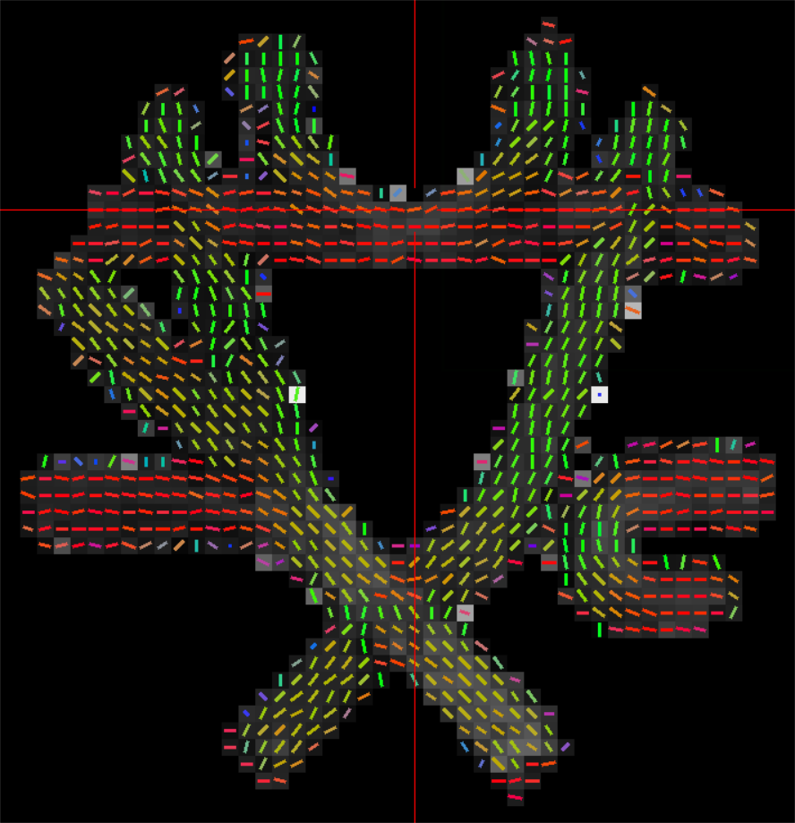
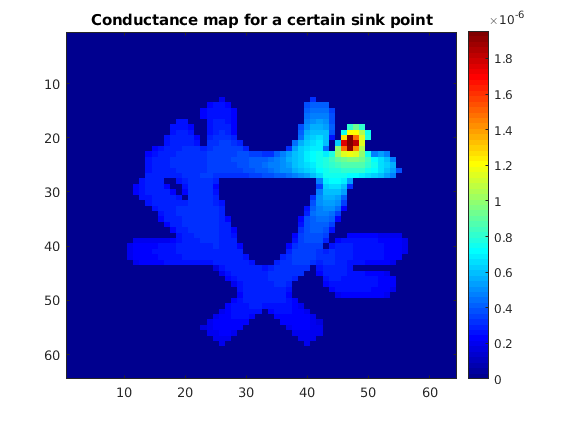
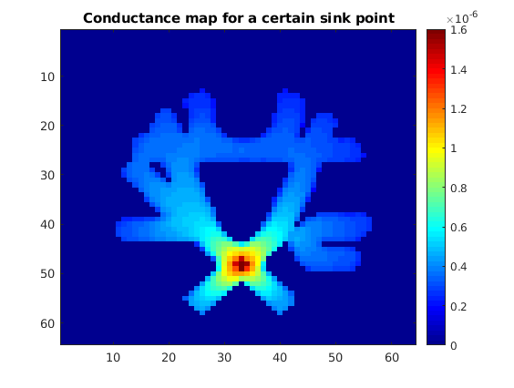
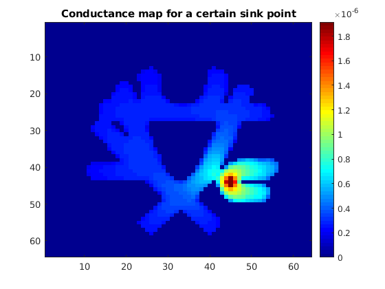
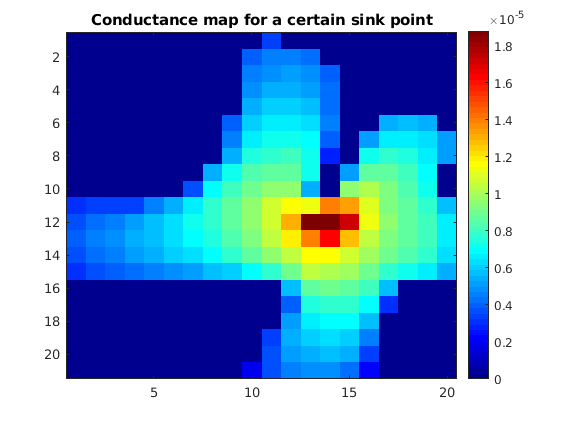

## Example 2: Compute conductance of Fibercup data, and plot it interactively

Code in [Examples/Connectivity/example_3D_tensor_fibercup.m](Examples/Connectivity/example_3D_tensor_fibercup.m)

Data can be downloaded in [www.tractometer.org](http://www.tractometer.org/original_fibercup/data/).
In this example, we use the file [acq-averaged_b-1500.nii.gz](http://www.tractometer.org/downloads/downloads/fibercup/dwi/acq-averaged_b-1500.nii.gz)

First we need to run DSI Studio to get the tensors, given some inputs: DWI data (data.nii.gz, bvals, bvecs), and a brain mask (nodif_brain_mask.nii.gz)
```
dsi_studio_run --action=src --source=data.nii.gz --bval=bvals --bvec=bvecs --output=data.src.gz
dsi_studio_run --action=rec --source=data.src.gz --mask=nodif_brain_mask.nii.gz --method=1 --output_tensor=1 --output_dif=1 --output=data.src.gz.012fy.dti.fib.gz
```
The output of these instructions will be the file data.src.gz.012fy.dti.fib.gz, and contains the tensors resulting from the DWI data:
<p align="center">

</p>
Alternatively, you could generate your own tensors and load them as a volume of dimensions (im_x, im_y, im_z, tensor_x, tensor_y).

Load the data:
```
file_name = fullfile(your_folder, 'data.nii.gz.src.gz.012fz.dti.fib.gz'); 
[fa0, md, im0, voxel_size] = read_fib(file_name);
```
It takes a while to run, so you may want to try it with small parts of the image. The default image_size '0' loads the whole image, but you can load a 5x5 image setting image_size to '2' or a 20x21 image setting image_size to '1'.
```
image_size = 0;
if image_size==2
    ax = 32:36; ay = 22:26;
elseif image_size==1
    ax = 31:50; ay = 13:33;
else
    ax = 1:size(im0,1); ay = 1:size(im0,2);
end
im = squeeze(im0(ax, ay, :, :, :));
fa = fa0(ax, ay, :);
```
You will get these images: 

Now run the conductance model and plot the results interactively. 
```
Nx = size(im, 1); 
Ny = size(im, 2); 
Nz = size(im, 3); 
[meshstruct, D, M, RHSbc] = computeDiffusionMatrix3D(im, size(im));
[potentials, mask_index] = computePotentials3D(D, meshstruct, M, RHSbc);
interactiveConductance3Dslice(fa, [Nx,Ny,Nz], potentials, mask_index, 3, 2);
```
After running this, an FA image will appear. 
<p align="center">

</p>
Click on a voxel in the FA image and wait. A conductance map from that point to the rest of the points will be generated. See here some examples. The voxel that we clicked is the reddest one.
<p align="center">
  
</p>
For the medium image size, the results will look like:
<p align="center">
  
</p>


