## Example 1: Compute conductance of different shapes, and plot it interactively

Code in [Examples/Connectivity/example_2D_tensor_test_cases.m](Connectivity/example_2D_tensor_test_cases.m)

In this example, we generate data ourselves with 2D tensors making different shapes, and we can check how our condutance work interactively: click on a voxel and an image of the conductance map from that point to the rest will be generated.

For isotropic tensors:
```
im = zeros(imx, imy, 2, 2);
im(:,:,1,1) = 0.2;
im(:,:,2,2) = 0.2;
fa = sum(sum(im,4),3);

[meshstruct, D, M, RHSbc] = computeDiffusionMatrix2D(im, [imx, imy]);
[potentials, mask_index] = computePotentials2D(D, meshstruct, M, RHSbc);
interactiveConductance2D(fa, [imx, imy], potentials, mask_index);
```
<p align="center">
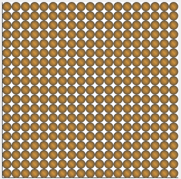 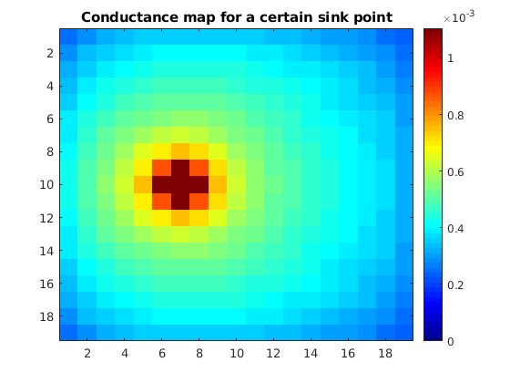 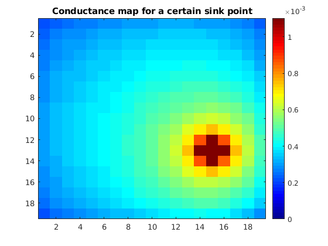
</p>

For a cross:
```
im = zeros(imx, imy, 2, 2);
tensor_base = [1, 0; 0, 0.2];
center = [round(imx / 2), round(imy / 2)];
for x=1:imx
    for y=1:imx
        im(x,y,:,:) = put_tensor(tensor_base,center,[x,y],0);
    end
end
im(10,10,:,:) = [1, 0; 0, 1];
fa = sum(sum(im,4),3);

[meshstruct, D, M, RHSbc] = computeDiffusionMatrix2D(im, [imx, imy]);
[potentials, mask_index] = computePotentials2D(D, meshstruct, M, RHSbc);
interactiveConductance2D(fa, [imx, imy], potentials, mask_index);
```
<p align="center">
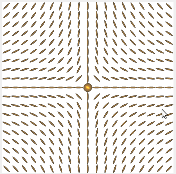 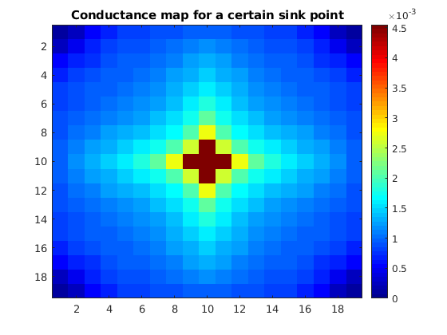 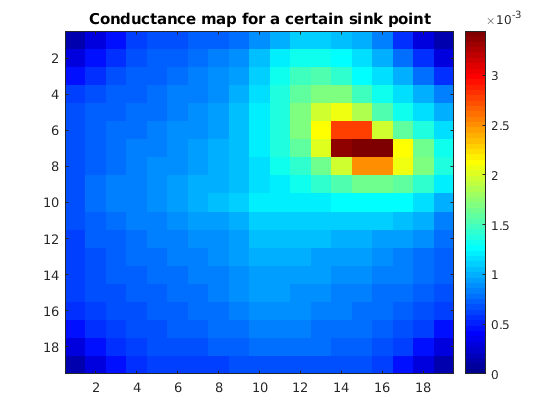
</p>

For a star:
```
im = zeros(imx, imy, 2, 2);
tensor_base = [1, 0; 0, 0.2];
center = [round(imx / 2), round(imy / 2)];
for x=1:imx
    for y=1:imx
        im(x,y,:,:) = put_tensor(tensor_base,center,[x,y],1);
    end
end
im(10,10,:,:) = [1, 0; 0, 1];
fa = sum(sum(im,4),3); 

[meshstruct, D, M, RHSbc] = computeDiffusionMatrix2D(im, [imx, imy]);
[potentials, mask_index] = computePotentials2D(D, meshstruct, M, RHSbc);
interactiveConductance2D(fa, [imx, imy], potentials, mask_index);
```
<p align="center">
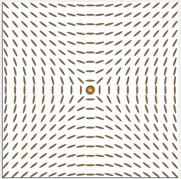 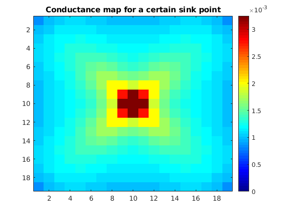 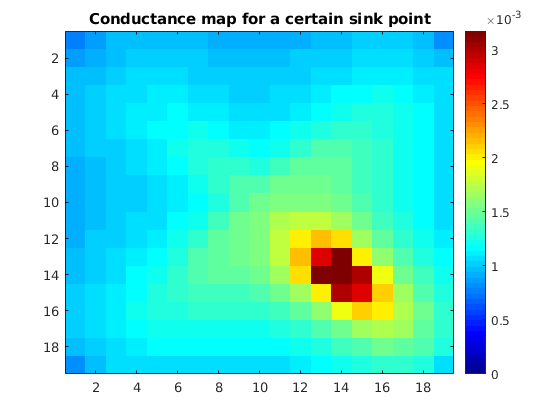
</p>

For a circle:
```
im = zeros(imx, imy, 2, 2);
tensor_base = [1, 0; 0, 0.2];
center = [round(imx / 2), round(imy / 2)];
for x=1:imx
    for y=1:imx
        im(x,y,:,:) = put_tensor(tensor_base,center,[x,y],2);
    end
end
im(10,10,:,:) = [1, 0; 0, 1];
im = im + eps;
fa = sum(sum(im,4),3); 

[meshstruct, D, M, RHSbc] = computeDiffusionMatrix2D(im, [imx, imy]);
[potentials, mask_index] = computePotentials2D(D, meshstruct, M, RHSbc);
interactiveConductance2D(fa, [imx, imy], potentials, mask_index);
```
<p align="center">
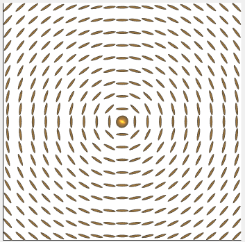 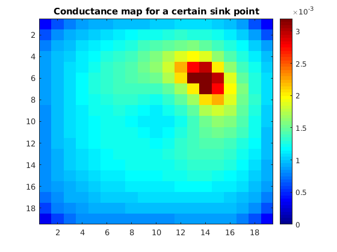 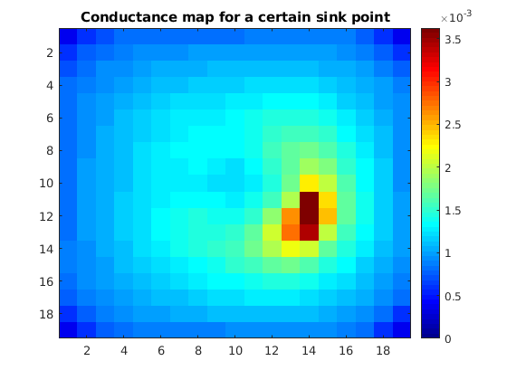
</p>
